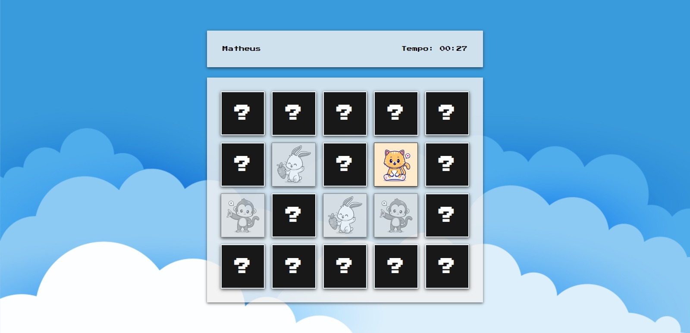

<h1 align="center">Jogo da <a href="https://memory-game-six-silk.vercel.app/">Memória</a></h1>

 

 

Jogo da Memória, um jogo que muitos conhecem e já jogaram e por isso decidi criar um com o tema bem fofo e divertido para que acalme a mente das pessoas através de cada carta.

<b>Obs</b>: Se quiser ver o projeto em funcionamente, clique na palavra "memória" no título. 👍

 

## Quais tecnologias eu utlizei ??

Dessa vez decidi voltar as raízes e utilizar somente HTML, CSS e JAVASCRIPT. E porque? Bom, eu senti que algumas das minhas habilidades não estavam sendo melhoraras ou estão estagnadas por estar sempre usando Vue.js, que facilita muitas coisas, e como gosto de manter uma base bem sólida decidi que iria pelo básico.

 

## Como foi a criação do projeto e quais as dificuldades ??

A criação do projeto foi simples, porém, divertida. Gostei de voltar a fazer códigos apenas com html, css e js. Cada parte do código sendo criada como o login e depois desenvolvendo o sistema do jogo e suas regras foi um pouco complexa (tenho que admitir haha), ainda foi uma boa experiência para melhorar minhas habilidades de resolução de problemas

Estarei listando minhas principais dificuldades:

- Design do site
- Por onde começar
- Criação das cartas

### Conheça-me

<a href="mailto:matheusnascimentox725@gmail.com">
